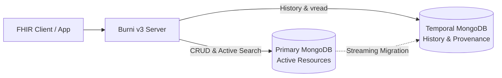

# Temporal & Dual-Database Architecture

Enterprise health systems demand auditability: every resource change or deletion creates an immutable record. Over time, historical versions dwarf active resources, leading to index bloat and degraded read latency.

**Burni v3** introduces a **Temporal & Dual-Database Architecture** to solve this problem cleanly.

---

## Architectural Topology

### 1. Separation of Concerns
- **Primary Database**:
  - Contains strictly the current active resources.
  - Keeps working sets in memory for maximum throughput on clinical lookups and complex search queries.
- **Temporal Database**:
  - Stores historical revisions (`*_history` collections), HTTP request contexts, and audit provenance data.
  - Indexed on timestamps, versions (`versionId`), and resource identifiers.

### 2. Provenance & Audit Guarantees
- **BundleRequest Capture**: Every version records its originating HTTP headers, transaction boundaries, and actor credentials.
- **High-Precision vread**: Historical requests (`[baseUrl]/[type]/[id]/_history/[vid]`) route straight to the temporal store without impacting active resource queries.

---

## Operational Advantages

1. **Tiered Storage Optimization**:
   - Keep Primary DB on high-performance NVMe volumes, while placing Temporal DB on cost-effective storage tiers.
2. **Independent Backup & Recovery**:
   - Establish dedicated snapshot policies for operational data versus long-term audit archives.
3. **Transparent Execution**:
   - Burni's internal Data Operator layer abstracts database routing completely—no custom code is required at the API route level.
