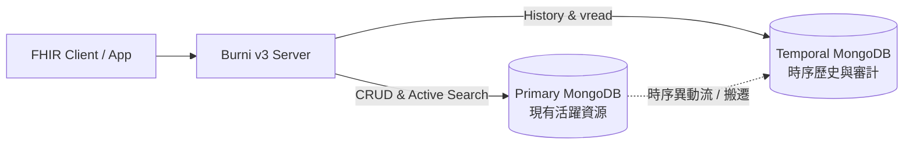

# 時序與雙資料庫架構解析

在大型醫療資訊系統（HIS）與健康資料交換平台中，FHIR 伺服器的資料量往往呈指數級成長。尤其是依據 FHIR 規範，所有資源修改與刪除操作都必須寫入歷史版本，歷史版本資料量往往是當前資源的數倍至數十倍。

**Burni v3** 採用了創新的 **Temporal & Dual Database 架構**，從根本上解決了大量歷史資料引發的資料庫膨脹與查詢延遲問題。

---

## 架構設計理念

### 1. 職責分離 (Separation of Concerns)
- **Primary DB（活躍資源資料庫）**：
  - 僅存放最新的 Active 資源版本。
  - 資料庫容量精簡，索引可常駐記憶體（Working Set），大幅提升日常臨床檢索與 RESTful API 的回應速度。
- **Temporal DB（時序歷史資料庫）**：
  - 存放所有資源的歷史修訂版（`_history` 集合）、HTTP 請求關聯紀錄與 Provenance 審計資料。
  - 針對時間序列（Timestamp）、版本編號（`versionId`）進行複合索引優化。

### 2. 資料一致性與 Provenance 保證
在 v3 中，針對資源更新的歷史歸檔流程進行了精準強化：
- **BundleRequest Provenance 保全**：確保在交易（Transaction）與批次操作下，每個版本都能完整對應到發起請求的 HTTP 標頭與使用者識別。
- **vread 操作精確回溯**：即便資源已經過多次更新或甚至邏輯刪除，客戶端依舊能透過 `[baseUrl]/[type]/[id]/_history/[vid]` 快速且零延遲地從 Temporal DB 讀取當時的快照。

---

## 營運與維護優勢

1. **分級儲存 (Tiered Storage)**：
   - Primary DB 可配置高 IOPS 的 NVMe SSD，Temporal DB 則可配置具備成本效益的大容量儲存媒體，大幅節約雲端基礎設施成本。
2. **獨立備份策略**：
   - 活躍資料庫與歷史資料庫可採用不同的快照與備份排程，提高容災復原（Disaster Recovery）的彈性。
3. **無縫切換**：
   - Burni v3 核心提供了透明的 Data Operator 層，對上層業務邏輯與外掛模組保持完全透明，無需更改現有 API 呼叫方式。
