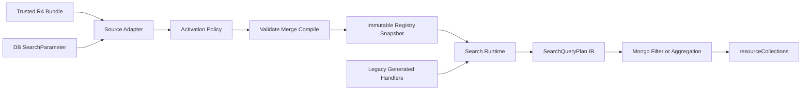

## Context

目前 build 流程由 `api_generator/API_Generator_V2.js` 讀取 `FHIRParametersClean.json`，再透過 `api_generator/parameterHandler.js` 產生各 resource 的 `*ParametersHandler.js`。`parameterHandler.js` 以字串切割和少量特殊規則處理 `field`，因此沒有保留 FHIRPath expression 的語意；runtime 的 `searchParameterCreator.js`、`searchParameterQueryHandler.js` 與 `queryBuild.js` 則直接依賴這些 generated handler。

專案已具備 FHIR R4 `SearchParameter` Mongoose model，但它目前只負責 resource CRUD 與 history，沒有形成 runtime registry。搜尋文件直接儲存於各 resource collection 的巢狀欄位，既有 normal search 使用 Mongo filter，chain search 使用 aggregation。現有 dependency 沒有已接入的 FHIRPath parser；因此 compiler 必須有清楚的 parser/AST 邊界，不能以字串替換或 runtime eval 取代解析。

## Goals / Non-Goals

**Goals:**

- 以可追蹤的 FHIR R4 SearchParameter resource 建立內建與 DB definition registry。
- 將 resource metadata、effective activation、compiler capability 與 diagnostics 分開。
- 以受限 FHIRPath AST 和 `SearchQueryPlan` IR 支援可驗證的 Mongo filter 與 aggregation。
- 維持既有搜尋 API、unknown parameter error flow 與 generated handler 的遷移相容性。
- 讓一層 controlled reference chain 有安全邊界，並為 recursive chain 保留可擴充 contract。

**Non-Goals:**

- 第一階段不實作完整 FHIRPath evaluator、reference target resource dereference、terminology evaluation、任意函數或 arithmetic；`resolve() is Type` 僅支援 bounded reference target type guard。
- 第一階段不支援 `composite` 與 `special` SearchParameter type。
- 第一階段不建立 materialized search-index collection，也不承諾所有可編譯查詢都有適合的 Mongo index。
- 第一階段不把 `_include`、`_revinclude`、`_sort`、分頁或 summary 改造成 SearchParameter definition。
- 第一階段不實作 recursive chain；只建立 depth/cost/cycle 的擴充欄位與拒絕邊界。
- 第一階段不把 token 擴到 CodeableConcept `.text`、date-on-Period 改成 overlap、Address `.text`，也不實作 SampledData quantity bounds。

## Decisions

### 1. 將 FHIR resource 與 effective definition 分層

新增 source adapter 將兩種來源正規化成同一個 SearchParameter definition：

- 受版本控制的官方 R4 Bundle source。現有 `temp/search-parameters.json` 不能作為長期 source，因為 `temp/` 被忽略；實作時應將其移至 repository 內的 R4 resource fixture/source。
- `SearchParameter` Mongoose model 的 DB source，只讀取符合 registry loading policy 的 resource。

每個 definition 保留原始 resource、來源、canonical `url/version`、`base/code`、effective status、compile state 與 diagnostics。trusted official Bundle 的 draft 由 activation overlay 提升為 effective active，但不得改寫 JSON 或 DB resource；DB definition 則必須是 `active` 才能進入 effective registry。

同一 canonical `url/version` 的 DB entry 可作為其 bundled copy 的 overlay；若不同 canonical definition 對同一 `(base, code)` 形成 active conflict，兩者皆不得成為該 lookup key 的有效 definition。這比以載入順序覆蓋更能避免搜尋語意悄悄改變。

### 2. 以 immutable snapshot 作為 runtime registry

Registry manager 維護一份只讀 snapshot，內容至少包含：

- canonical identity index；
- `(resourceType, code)` lookup index；
- disabled/conflict index，避免停用 definition 意外落入 legacy fallback；
- compiled query plans，且以 `(resourceType, code)` lookup 為單位，不得讓多個 `base` 共用一份未篩選的 plan（見 `docs/adr/0002-searchqueryplan-per-lookup.md`）；
- source、effective activation、capability 與 diagnostics。

啟動、SearchParameter CRUD 成功後或管理操作明確觸發 reload 時，loader 建立完整新 snapshot；只有 validation、activation、conflict、compile 都完成後才 atomic swap。搜尋請求在開始時取得 snapshot reference，整個請求不重新查詢 definition。

### 3. 以 parser、validator、compiler 三段處理 FHIRPath

compiler pipeline 固定分成：

1. parser 將 expression 轉成 AST；不得以 `split("|")`，因為 FHIRPath union 與舊欄位分隔規則不同。
2. validator 依 resource base、FHIR R4 grammar subset、path schema 與安全 allowlist 驗證 AST。
3. compiler 將 AST 轉成 value extraction predicate，再交給 type-specific query builder 產生 `SearchQueryPlan`。

第一階段 allowlist 包含 property navigation、collection flatten、union、`where(resolve() is Type)` reference type guard、choice `as` type selection、existence，以及 Patient `email`/`phone` 所需的固定 `ContactPoint.system` literal predicate。非 allowlisted 的 literal `where` comparison 與 target dereference 維持 unsupported。compiler 應提供 parser adapter interface，使實作可以採用維護中的 FHIRPath parser dependency 或受限內部 parser，而不讓 parser 選擇滲入 runtime executor。若 parser 不能產生可驗證 AST，definition 必須停用。

### 4. 以 bounded guard 與 typed choice selection 擴充 expression

`where(resolve() is Type)` 只建立 reference target type guard，不建立 target resource dereference。Compiler 將 reference path 降為既有 Reference `.reference` projection，並把 `Type` 保留在 plan 的 guard metadata；relative 與 absolute URL 都只解析 URL path 的 resource type。若 `Reference.type` 存在，executor 必須驗證它與 reference path 一致；versioned、`#contained` 與 `Reference.identifier` 不進入此 lowering。

`(path as Type)` 與 `.as(Type)` 進入相同的 choice selection lowering。`as` 只選擇 FHIR choice element，不做資料轉型，也只允許作為 choice path 的最後一段；physical field name、FHIR datatype 與 nested search leaf 由 Resource type map 和 search-type projection 決定。`ofType` 與非 allowlisted 的 literal `where` predicate 不沿用現有 AST 外觀，直接由 parser/validator 拒絕。固定的 `system='email'`/`system='phone'` predicate 必須作為 typed plan predicate 保留。

Alternative：將 `resolve()` 降成任意 reference 字串查詢，或讓 `as` 直接拼接欄位名稱。Rejected：前者會遺失 target type 語意，後者無法保證 choice element casing、datatype 與 stored field set 正確。

### 5. 使用 SearchQueryPlan IR 隔離 FHIR 語意與 Mongo

`SearchQueryPlan` 是 compiler 與 executor 之間的唯一 contract，應包含：

- resource base 與 target；
- 該 lookup resource type 的 typed `extractionPaths`（path + FHIR datatype）；
- expression AST 的已驗證 extraction/predicate、reference target guard 與 choice selection metadata；
- FHIR search type、modifier、comparator capability；
- multipleOr/multipleAnd semantics；
- normal filter 或 relation/aggregation operation；
- depth、estimated cost、required index metadata；
- diagnostics 與 source identity。

一般 path 先由 plan executor 產生既有 resource collection 的 Mongo filter；reference type guard 使用 `.reference` projection 與受控 target guard，reference chain 仍使用 relation plan 產生受控 aggregation。Mongo operator、field path、regex 與 aggregation stage 都只能由 allowlisted plan node 產生，絕不執行 expression 文字或任意 DB operator。Reference array 的 value 與 type guard 必須透過 correlated predicate 綁定同一個 array element。

### 6. 將 type/operator capability 明確化

建立以 SearchParameter type 為 key 的 capability matrix，涵蓋 number、date、string、token、reference、quantity、uri 的 value parser、comparator、modifier 與多值規則。SearchParameter 宣告的 expression 若不可編譯，definition 直接停用；若 definition 可編譯但 client 使用未宣告的 operator，query validation 明確拒絕，不使用較寬鬆的 fallback。

既有 `queryBuild.js` 與 `searchParameterQueryHandler.js` 的可重用邏輯應被收斂成 type-specific executor primitives。Executor 依 `(search type, FHIR datatype)` 做 search-type projection；datatype 來自 Resource type map（`to-code-use-definition`），由 compiler 寫進 `extractionPaths`。修正或保留既有行為時，以 R4 fixture 和現有 API 的 field set 為依據，不把 `parameterHandler.js` 的特殊字串規則搬進新 compiler，也不複製已知的 legacy 解析缺陷（例如 quantity 把 `eq10` 變成 `$eq: null`）。不相容的 `(search type, datatype)` 分支（例如 quantity 遇上 SampledData、type map 找不到的 path）從該 lookup 的 plan 省略並留下 diagnostic，而不是產生假 filter。見 `docs/adr/0003-search-type-projection-existing-api.md`。

Reference query value parser 對 relative reference 與 absolute URL 保留既有精確比對；bare ID 在 expression 已知 target type 時依該 type 正規化。absolute URL 只解析 path 中的 resource type，不發出遠端請求。versioned、`#contained` 與 logical identifier value 在 query validation 階段拒絕，不能降級為 regex 或 legacy handler。

### 7. 將 registry 接到 runtime，保留可撤回的遷移層

`searchParameterCreator.js` 先用 `(resourceType, code)` 查 snapshot：

1. effective definition 存在時，使用 compiled plan；
2. code 位於 disabled/conflict index 時，走 unknown parameter error；
3. snapshot 完全沒有該 code 時，遷移期才允許既有 generated handler fallback。

這個順序避免一個已知但不安全的 SearchParameter 因 compiler 失敗而被 legacy handler 意外重新啟用。generated handler 可同時用於 shadow comparison，記錄 registry plan 與 legacy query/result 差異，但不得覆寫 registry 的判定。Shadow comparison 是診斷，不是把 resource type 放入 `enabledResourceTypes` 的唯一門檻；啟用依 registry 自己的正確性測試。

`_id` 與 `_lastUpdated` 透過同一 compiler contract 納入 registry；`_include`、`_revinclude`、`_sort`、分頁與 summary 保持現有 control-parameter pipeline。

### 8. 以受控 relation plan 實作 chain

reference SearchParameter 的 chain 只從其 `chain`、`target` 與 registry lookup index 解析，不能直接把 request 的任意字串轉成 collection 或 field。v1 relation plan 只允許一層 target search，並帶有 depth=1 與 estimated cost。超過一層或無法驗證 target/code 時，在 query validation 階段拒絕。

IR 以 relation node 表達 target、下一個 parameter、depth、cycle guard 與 cost budget，讓未來 recursive chain 可以擴充；v1 不執行 recursive relation，也不引入無界 `$lookup`。

### 9. 以 capability、diagnostics 與測試作為啟用門檻

Registry diagnostics 應可從啟動/reload log 與管理診斷介面取得，至少包含 canonical identity、base/code、source provenance、原始 status、effective status、停用原因、expression 與 capability failure。正常搜尋回應不應洩漏未啟用 definition 的內部細節。

測試分層如下：

- resource validation、source merge、activation overlay、identity/conflict、snapshot atomicity；
- expression parser/validator/compiler fixtures，包含 union、predicate、type guard、choice、existence 和 unsupported expression；
- type/operator/multiple value capability contract；
- SearchQueryPlan 到 Mongo filter 的 golden tests，覆蓋 search-type projection、union 全分支、choice element name、Incompatible branch 省略；
- 以 Mongo test database 驗證 nested array、Address/HumanName、choice type、combo-code 與 query result；這些與 golden tests 同為 registry 啟用門檻；
- registry 與 legacy handler 的 migration comparison tests（診斷用，不是 enablement 唯一門檻）。

### Patient complete migration contract

Patient 的 Mongo integration slice 使用 opt-in MongoMemoryServer helper，不改根 mocha hook。測試直接呼叫 `CreateService`、`ReadService` 與 `SearchService`，以 fake request/response 驗證 create → read → Registry search 流程；測試環境強制啟用 Patient Registry 並關閉 legacy fallback。

本次 contract exactly covers `active`、`address`、`address-city`、`address-country`、`address-postalcode`、`address-state`、`address-use`、`birthdate`、`death-date`、`deceased`、`email`、`family`、`gender`、`general-practitioner`、`given`、`identifier`、`language`、`link`、`name`、`organization`、`phone`、`phonetic`、`telecom`。每個 code 都必須有 positive/negative hit-set、companion 不命中、declared type/operator/multiplicity 與 `:missing` 測試。

`patient-example-f201-roel.json` 作為主 fixture，補充 `generalPractitioner` 與 `link`；另一個 Patient fixture 覆蓋 `deceasedDateTime`、nested Address/HumanName、email/phone ContactPoint 與 negative cases，避免與主 fixture 的 `deceasedBoolean` choice 衝突。`deceased=true` 必須同時涵蓋 Boolean true 與 DateTime，`deceased=false` 只涵蓋明確 Boolean false；email/phone 必須驗證固定 system 與 value 的同一 ContactPoint correlation。Address.text 不納入本階段 projection，phonetic 維持相容性字串匹配。本 slice 不建立 Organization、不驗證 reference chain；production `enabledResourceTypes` 由全部 gate 通過後的 rollout 步驟設定。

流程關係：

## Risks / Trade-offs

- [FHIRPath parser compatibility] 不同 parser 對 R4 grammar 或 AST 形狀的支援可能不同 → 以 parser adapter、固定 AST contract 與 expression fixture 隔離，parser 不能驗證的定義停用。
- [官方 draft activation] 將官方 draft 視為 effective active 可能與原始發布狀態混淆 → 永遠保留 raw resource status，另存 provenance-aware activation overlay。
- [Registry 與 DB CRUD 競態] reload 期間不同 request 可能看到不同定義 → 使用完整 immutable snapshot 與 atomic pointer swap，單一 request 固定 snapshot。
- [Legacy fallback 遮蔽錯誤] compiler 停用後若仍 fallback，可能重新啟用不安全 expression → 分開 disabled/conflict index 與完全未知 code，只有後者可 fallback。
- [Mongo 效能] nested array、contains/regex、aggregation chain 可能無法有效使用 index → plan 記錄 estimated cost/required index metadata，限制 regex、chain depth 與 aggregation cost；第一階段不承諾 materialized index。
- [FHIR 語意與既有結果差異] multipleOr/multipleAnd、modifier 或 comparator 會改變現有固定 `$and/$or` 行為 → 這一階段 projection 對齊既有 API field set；full R4 `.text` / Period overlap 另做。Shadow filter 對不上（例如 legacy quantity `$eq: null`）不得擋住 enablement。
- [Reference 語意不完整] 不同 reference 格式、`Reference.type` 與 array element 可能造成 false positive → 只允許 bounded target guard，驗證 reference path/type 一致性，對 array 使用 correlated predicate，unsupported value 明確拒絕。
- [Choice lowering 遺失 branch] parser 或 executor 只保留一個 choice branch 會造成 false negative → 兩種 `as` syntax 共用 typed selection lowering，所有可投影 union branch 以 OR 執行，未知語意整個 definition disabled。
- [跨 base 共用 plan] 一份 canonical `compiledPlan` 會讓 Patient 查到 `Person.address`，也無法分辨 `Patient.name` 與 `Location.name` → 每個 lookup 獨立 typed plan。
- [SearchParameter source 衝突] 同一 `(base, code)` 的 custom definition 可能與官方定義衝突 → exact canonical overlay only；其他 active conflict 整組停用並 diagnostics，不採載入順序勝出。

## Migration Plan

1. 將官方 R4 Bundle 放入版本控制的 source/fixture 位置，建立 source adapter、activation policy、registry diagnostics 與 capability matrix，但先不切換 runtime。
2. 建立 AST validator、SearchQueryPlan compiler、Mongo executor 與 registry snapshot，先以 fixture 和 test database 驗證結果；測試 `resolve()` target guard、兩種 `as` syntax、choice union、reference array correlation 與 invalid reference values。
3. 接上 SearchParameter CRUD 成功後的 atomic reload；啟用 registry-first lookup，保留 generated handler fallback 與 shadow comparison。
4. 先完成 Patient 23-code contract：通用 nested datatype resolver、allowlisted Patient predicates、ContactPoint correlation、choice semantics、`:missing`、declared operator/multiplicity 與每個 code 的 positive/negative hit-set 都必須通過；shadow filter 全等不是 gate。
5. 將 `Patient` 加入 `enabledResourceTypes`，對已列出的 23 個 code 關閉 legacy fallback；未列出的 Patient custom/unknown code 暫保留 migration fallback 與 feature-flag rollback。
6. 其他 resource 依相同 golden filter 與 document fixture 門檻逐步啟用；所有既有 parameter 都由 registry 提供且 fallback 不再被使用後，才移除 `FHIRParametersClean.json` 作為 runtime/build source，最後移除 generated handler generation。

Rollback 以 runtime feature flag 將查詢入口切回既有 generated handlers；registry source、diagnostics 與新資料結構保留，避免 rollback 需要修改或刪除 FHIR SearchParameter resource。

## Open Questions

- 需要在實作階段依 parser 的實際 AST 能力選定 FHIRPath parser dependency 或受限內部 parser；此選擇不改變 registry、allowlist 或 `SearchQueryPlan` contract。
- SearchQueryPlan 是否 per lookup、projection 是否對齊既有 API field set，已分別記錄於 ADR 0002 與 0003，不再開放。
