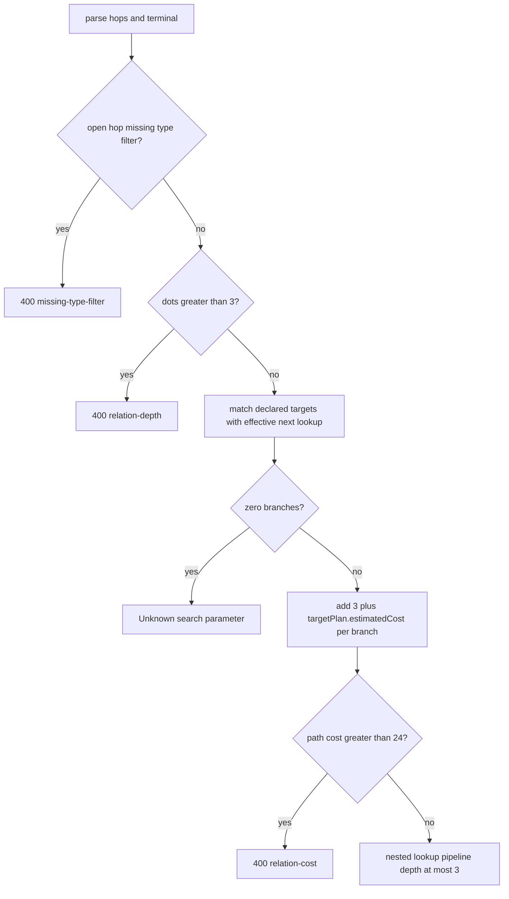

## Context

產品決策已定，見 `docs/adr/0008-bounded-multihop-chained-search.md`。動機見本 change 的 `proposal.md`，此處不重述。

現行 runtime 把第二個點當成 recursive chain 拒絕。`models/FHIR/searchParameter/executor/relationPlan.js` 設 `MAX_RELATION_DEPTH = 1`，`rest.length > 0` 回 `Recursive chain is not supported`。`MAX_RELATION_COST` 與 `MAX_QUERY_COST`（10）共用，公式是 `source.estimatedCost + target.estimatedCost + 3`。`sourceLookupKey === targetLookupKey` 會拒絕 `partof.partof`。OpenSpec `fhirpath-mongo-query` 仍寫第一階段一層／阻擋 recursive chain，必須先改規格才能動 executor。

Chain 解析與執行的實際邊界：

- `runtime/parameterName.js` 只在參數名稱的 head 切 type filter（`subject:Patient.name`）。中間段 `organization:Organization` 整段留在 chain 字串裡，`splitChainParameter` 不會當 type filter 用。
- 多個 reference target type 的迴圈覆寫單一 `targetPlan`，最後一個匹配的 plan 勝出；`targetLookupKey` 卻用 `matchedTargets[0]`。這是 last-plan-wins，不是 fan-out。
- `$lookup` pipeline 寫死一 hop。`buildRelationAggregation` 在 `depth > MAX_RELATION_DEPTH` 時 throw。datatype `Resource` 的 contained extraction path 會跳過，不進入 `$lookup`。
- `query.chain` 是 array；一個請求裡多個 chained parameter 各 push 一條 pipeline，同一個 aggregate 執行。
- 失敗在 `searchParameterCreator.js`、`bundleSearchValidation.js`、`condition-delete.js` 幾乎都收成 Unknown search parameter。`tryApplyRegistryParameter` 對任何 `!relation.valid` 回 `"disabled"`；creator 的 catch 再把內部 Error（例如 `Relation cost exceeds allowed limit`）收成 unknown。
- `registry/referenceMetadata.js` 的 `isDeclaredTarget`：declared targets 為空時，任何 typeFilter 都回 true。`buildRelationPlan` 對空 targets 另以 `Missing reference target type` 拒絕。
- `compiler/planMetadata.js` 的 `deriveTargets` 合併 `resource.target` 與 extraction path 上的 `referenceTargetType`。Compiler 的 `SearchQueryPlan.depth` 是 `resource.chain?.length ? 1 : 0`，官方 R4 的 `chain` 全空，所以幾乎都是 0。Relation depth 是參數名稱的點數，兩者不是同一個欄位。

官方 R4 SearchParameter：0 個 SP 的 target 含 `Resource`；80 個列出 145 型；封閉列表最多 9 型；1 個空 target。FHIR resource catalog（`models/FHIR/fhir.resourceList.json`）目前 146 型。

詞彙以 `CONTEXT.md` 的 Chained search 一節為準。

## Goals / Non-Goals

**Goals:**

- 以解析後的 hop list 遞迴組成 Relation path，每個 hop 保留匹配到的 reference target type 與該型別自己的 `SearchQueryPlan`。
- 每個 hop 都能解析 type filter，使 `subject:Patient.organization:Organization.name` 的中間 hop 不再卡在字串裡。
- 在 fan-out 與 cost 之前偵測 open reference target；缺 type filter 直接拒絕。
- Relation cost 依 hop 的可執行 lookup 寬度累加；`MAX_RELATION_COST = 24`，不與 `MAX_QUERY_COST` 共用。
- 具名 400 diagnostics（`missing-type-filter` / `relation-depth` / `relation-cost`）穿過 search、Bundle GET、conditional delete，不再把 limit 偽裝成 unknown。

**Non-Goals:**

- `_include`、`_revinclude`、`_has`。
- Request 層 cost cap。
- 沿 resource graph 走直到 cycle 或 budget 停下。
- 除 runtime relation depth 所需之外，不改 `SearchQueryPlan.depth` 的 compiler 語意。
- 不把 depth／cost 做成 env-configurable；維持模組常數，寫法比照 `MAX_QUERY_COST`。
- 不把 conditional delete 改成 aggregation 刪除。既有 `isChain` 執行拒絕維持現況；本 change 只讓它的驗證與具名錯誤與 search 同一套 composer。

## Decisions

### 1. 先組成 hop list，再遞迴巢狀 `$lookup`

Composer 讀完整參數名稱，得到 hop 序列與 terminal filter，再從 source plan 往下為每個 hop 解析 branches。每個 branch 是一對 `(targetResourceType, SearchQueryPlan)`，不再只留一個 `targetPlan`。

現行 `RelationPlan`（單一 `targetPlan`、`targetLookupKey`、硬編碼 `depth: 1`）改成 path：

- hop 陣列，長度等於 relation depth（參數名稱的點數）；
- 每個 hop 有 source plan、可選 type filter、以及該 hop 的 executable branches；
- terminal 是最後一段 filter parameter（可含 modifier）；
- path 級 `estimatedCost`。

`buildRelationAggregation` 對 hop list 遞迴組 pipeline：內層 hop 的 `$lookup` 放進外層 `$lookup.pipeline`，terminal hop 在最內層套該 branch 自己的 typed filter。Contained datatype `Resource` 的 path 仍跳過；它們不是 collection，也不是 open reference target。

無 type filter 的封閉 hop 只繼續宣告的 reference target types 裡、對下一個 code 有 effective Registry lookup 的型別。零匹配是 unknown，不是 empty hit-set。Chain allowlist 維持現況：empty／absent 不另限制 code；non-empty 只允許列出的 next-hop codes。官方 R4 bundle 的 `chain` 全空，不得把它當成必填。

替代方案：Mongo `$graphLookup` 沿 reference 走圖；application-side N+1 先查出 id 再查下一層。Rejected：chained search 是 client 指定的 dotted path，每 hop 的 SearchParameter、type filter 與 typed filter 都不同。`$graphLookup` 沒有 per-hop plan，也會把資料層迴圈當成遍歷問題。N+1 離開現有的單一 aggregate（`query.chain` 陣列），無法維持 correlated `$unwind`／`$match`。

### 2. 每個 hop 解析 type filter

擴充 `parseSearchParameterName`：以 `.` 切開後，最後一段是 terminal filter parameter，其 `:` 是 modifier（`name:exact`）。其餘每一段是 hop，`:` 是 type filter（`subject:Patient`、`organization:Organization`）。沒有點時維持現況，`:` 仍是 modifier。

因此 `subject:Patient.organization:Organization.name:exact` 得到 hop 1 `subject` + `Patient`、hop 2 `organization` + `Organization`、terminal `name` + `exact`。`parameterName.js` 仍可保留 head 的 `code`／`typeFilter`／`chain` 給非 chain 路徑，但 composer 必須吃 hop list，不得只看 head。

未宣告的 type filter（封閉 hop 的型別不在 declared targets、也不是下方第 3 點允許的 open 例外）維持 unknown，與現況 `Undeclared reference target` 同一類，不另開 limit class。

替代方案：繼續只 parse head，中間 `:Organization` 當下一 hop 的 code。Rejected：那會去查 code `organization:Organization`，永遠 unknown，client 寫的 type filter 等於沒寫。

### 3. Open reference target：空、含 `Resource`、或列舉 catalog

在 fan-out 與 cost 之前判定 hop 是否為 open reference target。符合任一即為 open，且該 hop REQUIRES type filter：

1. declared targets 為空；
2. 含 token `Resource`；
3. declared targets 列舉 FHIR resource catalog。

列舉以 `models/FHIR/fhir.resourceList.json`（目前 146）做集合比較，不得寫死 145，也不得用「超過 9 型就算 open」。官方 R4 有 80 個 SP 共用同一份 145 型列表、0 個寫 `Resource`、封閉列表最多 9 型。145 與 146 的差一必須仍判為 open。若實作成 `targets.length === catalog.length`，那 80 個 SP 會被當封閉 fan-out，一次 hop 就對約 145 個 collection 做 `$lookup`。

Open hop 缺 type filter：在算 cost 之前拒絕，diagnostic class `missing-type-filter`。有 type filter 時，該型別就是要 lookup 的 collection，不把空 targets 或 145 型列表展開成 catalog。

替代方案：把 145 型列表當 `Patient|Group` 一樣 fan-out；或用封閉列表觀察值 9 當天花板。Rejected：ADR 0008 已否決前者。後者把觀察值變成魔法數字，catalog 一變就錯，也無法解釋為什麼 10 型算 open、9 型算封閉。

### 4. 空 targets 的 `isDeclaredTarget` 與 chain 分開

`isDeclaredTarget` 對空 targets 回 true 的行為保留，且不在本 change 改 `_include`／`_revinclude` 所用的判定。Chain composer 另做兩件事：

- Open hop（含空 targets）沒有 type filter 就拒絕，即使 `isDeclaredTarget(plan, undefined)` 為 true。
- 空 targets 一旦有 type filter，該字串就是 collection 名稱，去 Registry 查該型別的 next code。不把空 list 展開成 146 個 catalog type。含 `Resource` 的 hop 同樣以 type filter 命名 collection，不得因 `targets.includes("Patient") === false` 就當成 undeclared。

145 型列舉仍用 declared set 檢查 type filter：列出的 145 型可 chain；catalog 裡那一個沒被列出的型別是 undeclared，走 unknown，不是 missing-type-filter。

現行 `declaredTargets.length === 0` → `Missing reference target type` 刪除。那 1 個官方空 target SP 改走 open 規則。

替代方案：空 targets 維持整條 chain 拒絕；或空 targets 合法時 fan-out 整個 catalog。Rejected：空 list 的 FHIR 意思是未限制型別，不是「沒有型別」。展開 catalog 與 145 型 fan-out 是同一個成本爆炸。

### 5. Path 級 cost：每 branch 加 `(3 + targetPlan.estimatedCost)`，上限 24

`MAX_RELATION_COST = 24`，只約束一條 chained search path（一個參數名稱組成的 hop tree），不與 `MAX_QUERY_COST`（10）共用。每個 hop 對每個 executable lookup branch 加上 `(固定 overhead + 該 branch 的 targetPlan.estimatedCost)`。固定 overhead 維持 3，與現行單一 hop 的 `+ 3` 同一筆 `$lookup` 成本，不是從 10 倒推的數字。

兩個型別、estimatedCost 各為 2 與 3 的 hop，貢獻 `(3+2)+(3+3)=11`。Last-plan-wins 會只加最後一個 plan，成本與 filter 都會算錯。Source plan 的 `estimatedCost` 不再加進 relation cost；那是起點 collection 的 filter，已受 `MAX_QUERY_COST` 約束。這取代 `source.estimatedCost + target.estimatedCost + 3`。

Depth 先查：點數 > 3 為 `relation-depth`，不必再算 cost。Cost > 24 為 `relation-cost`。兩者都在 composer 判定，不在 aggregation throw 內部字串。不設 request 層上限；`query.chain` 可含多條 path，疊加是接受的 residual。

替代方案：繼續與 `MAX_QUERY_COST` 共用，或保留 `source + target + 3`；對整個 HTTP 請求加總。Rejected：兩 hop 就貼 10，三 hop 必失敗，四個封閉 target 與一個同價。Request cap 無法指出是哪個參數炸掉 budget。

### 6. 刪除 same-key cycle check

刪除 `sourceLookupKey === targetLookupKey` 這段。`Organization?partof.partof.name=` 合法。有限長度的 `$lookup` pipeline 不會因為資料裡的 reference 迴圈而變成無界遍歷。不另設 relation cycle limit。

`SearchQueryPlan.depth` 維持 compiler 對官方 `chain` 欄位的語意。Runtime 的 `MAX_RELATION_DEPTH = 3` 與 path.depth 用參數名稱點數，不把 compiler depth 改成 hop 計數。

替代方案：把重複的 `(resourceType, code)` 當 cycle。Rejected：那禁掉合法階層 chain。ADR 0008 已否決。

### 7. 失敗分類：unknown 維持 unknown，limit 用具名 400

Composer 回傳結構化結果，至少區分 `valid`、unknown 類、以及 limit class。不得只回 reason 字串再讓入口猜測。

仍映射為 Unknown search parameter（現有 400／unknown 契約）：

- 某一 hop 的 code 沒有 effective lookup；
- 封閉 hop 的 type filter 不在 declared targets；
- 145 型列舉上，type filter 不是列出的型別；
- lookup disabled；
- 非 reference 卻做 chain、缺 terminal code、chain allowlist 未列出該 code。

改為 400 OperationOutcome，且公開 diagnostics 必須帶穩定 class token：

| class | 何時 |
| --- | --- |
| `missing-type-filter` | open hop 沒有 type filter |
| `relation-depth` | 點數 > 3 |
| `relation-cost` | path cost > 24 |

不得把內部 reason（`Recursive chain is not supported`、`Relation cost exceeds allowed limit`、`Relation cycle is not allowed`）寫進 client 看得到的 diagnostics。公開文字可含參數名稱與 class，讓 `Composition.subject.name` 看起來像缺 `subject:Patient`，而不是這個伺服器不支援 chain。

入口：

- `registrySearchHandler`／`searchParameterCreator`：limit class 必須是 creator 不會收進 `UnknownSearchParameterError` 的 typed error。現行 `return "disabled"` 與 catch-all 都要改，否則 depth／cost 永遠是 unknown。
- `bundleSearchValidation`：`!relation.valid` 不再一律 `Unknown parameter`。
- `condition-delete`：同一 SearchParameterCreator 路徑。合法 chain 之後既有的 `isChain` 執行拒絕不變。

這是 **BREAKING**：先前把 depth 2 當 unknown 的 client 會改拿到具名 limit 或可執行結果。

替代方案：所有 chain 失敗都當 Unknown search parameter。Rejected：缺 type filter、超 depth、超 cost 會被看成「沒這個參數」。ADR 0008 已否決。

### 8. Aggregation 用巢狀 `$lookup`，深度上限 3

`buildRelationAggregation` 不再假設單一 target plan。對每個 source extraction path（跳過 datatype `Resource`）與每個 hop branch 產出 `$unwind`、correlation `$match`、然後 `$lookup`。內層 hop 的 lookup 放在外層 `pipeline` 裡，讓該 hop 的 type filter 與下一 hop 的 typed filter 作用在同一批 target document。最內層才套 terminal `createTypedFilterPlan`；plan 必須是該 branch 的 plan，禁止再拿單一 `relationPlan.targetPlan` 套到所有 collection。

深度 3 是硬上限，對應最多三層巢狀 `$lookup`。`query.chain` 仍是 array，多個 chained parameter 各是一棵 hop tree、一條 pipeline。

替代方案：同層 sequential `$lookup` 再 `$unwind` alias；`$graphLookup`；應用層 N+1。Rejected：sequential 容易把不同 hop 的 typed filter 混在同一層，也比較難讓 `subject:Patient` 與 `organization:Organization` 各自約束自己的 collection。`$graphLookup` 與 N+1 見決策 1。

流程：

## Risks / Trade-offs

- [Request 疊加] 多個參數各 24，同一 aggregate 可遠超過單 path 上限 → 接受的 residual。具名錯誤必須能指出是哪一個參數；本 change 不加 request cap。
- [巢狀 `$lookup` 效能] 三層 lookup 加上封閉 fan-out 可能很慢 → depth 3、path cost 24、open target 強制 type filter 把 145 型展開擋在 composer。仍可能有合法但慢的封閉 hop（例如單 hop 接近 9 型且各 plan cost 不低，會先撞 24）。
- [145 vs 146] 用 catalog 長度當唯一相等條件會把官方 145 型列表當封閉 → 列舉判定必須把這份幾乎完整的 catalog 列表當 open，不能寫死 145，也不能用 9 當天花板。
- [錯誤契約 BREAKING] 把 depth 2 當 unknown 的 client 會看到可執行結果或具名 400 → 這是刻意的。測試必須覆蓋三種 class 與 unknown 的分界，避免再被 creator catch-all 吞回去。
- [last-plan-wins] 今日多 target 已可能用錯 filter 卻回 200 → 本 change 修掉。既有「碰巧最後一個型別正確」的測試若只 assert 200，不夠。每個 branch 要有自己的 plan 與 filter。
- [conditional delete] 合法 chain 仍會在 creator 之後被 `isChain` 拒絕 → 不在本 change 擴大範圍。風險是 client 以為 ADR 讓三入口都能執行 chain；驗證契約一致，刪除執行不在此。

## Migration Plan

1. 先改 `openspec/specs/fhirpath-mongo-query/spec.md`：拿掉第一階段一層／阻擋 recursive chain，改成 bounded multi-hop（depth 3、path cost 24、open target MUST type filter、無 cycle limit、chain allowlist 空等於不限制、具名 limit class）。規格未改前不改 runtime。
2. 擴充 `parameterName.js` 的 per-hop type filter parse，並改 `relationPlan.js` composer：hop list、per-type plans、open 判定、刪 cycle check、`MAX_RELATION_DEPTH = 3`、獨立 `MAX_RELATION_COST = 24`。既有一層 chain（`subject.name`、`subject:Patient.name`）必須仍可執行，cost 公式雖改，不得把原先合法的一 hop 打成 `relation-cost`。
3. 將 `buildRelationAggregation` 改為巢狀 `$lookup`；`registrySearchHandler` 改吃 path 而非單一 `targetPlan`。
4. 接上三入口的 typed limit error，使 `searchParameterCreator`、`bundleSearchValidation`、`condition-delete` 不再把 limit class 收成 unknown。
5. 測試以 `test/searchParameter/executor/relation-plan.test.js` 為主，補 parse、open target、`partof.partof`、多 target per-plan、depth／cost、三入口 mapping。Last-plan-wins 的舊期望刪除。

Rollback 是 revert 規格與 runtime。沒有資料遷移，也沒有 feature flag。沒有 SearchParameter resource 或 Mongo document 要改寫。
